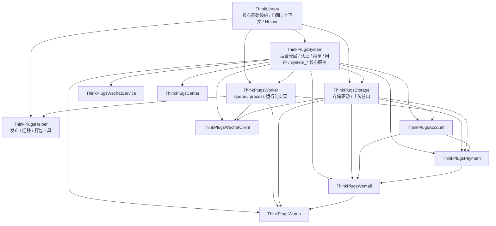
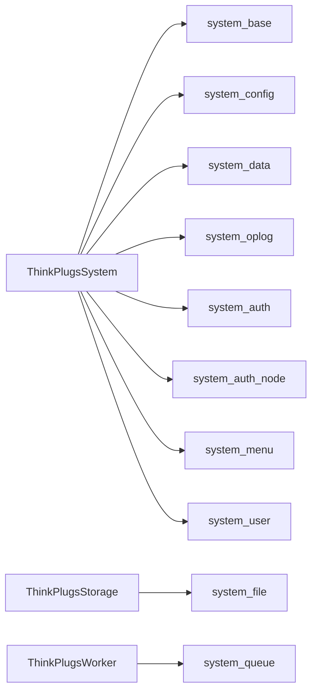
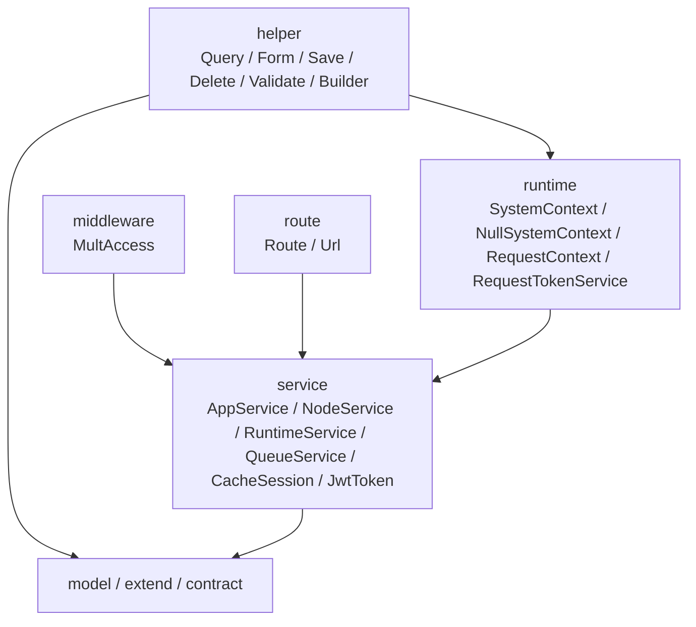

# Plugin Boundaries

## 相关文档

- [插件标准](./plugin-standard.md)
- [插件优先重构](./plugin-first-refactor.md)

## 当前分层

## 表归属

## Library 内部分层

## 关键约束

- `ThinkLibrary` 不直接持有 `system_* / system_file / system_queue` 域真实表实现。
- `ThinkPlugsSystem` 同时承载系统后台壳层和 `system_*` 核心数据，不再拆分独立 `Admin` 插件。
- `ThinkPlugsWorker` 提供 `ProcessService / QueueService` 的真实实现，`ThinkLibrary` 只保留门面。
- `ThinkPlugsStorage` 拥有 `system_file` 迁移和上传链路，不反向依赖 `Worker`。
- `FaviconBuilder / ImageSliderVerify / JsonRpcHttpClient / JsonRpcHttpServer` 这类跨组件基础能力保留在 `ThinkLibrary`，业务插件只消费，不重复实现。

## 目录规范

- 每个业务插件只保留 `src / stc / tests` 三层顶级目录。
- `src` 下优先使用标准目录：`controller / lang / model / route / service / view`。
- 只有确实需要命令入口的插件才增加 `command` 目录。
- `src` 根目录只保留 `Service.php`，以及确实需要全局函数时才保留 `common.php`。
- 不再新增 `auth / runtime / system / support / integration / queue / storage / handle` 这类职责模糊目录；相关实现统一收敛到 `service` 或更明确的标准目录。

## 已有自动化守卫

- 代码位置边界：`ArchitectureBoundaryTest`
- 迁移归属边界：`MigrationOwnershipTest`
- Composer 依赖边界：`ComposerDependencyBoundaryTest`

这些测试已经纳入根 `composer test`。
