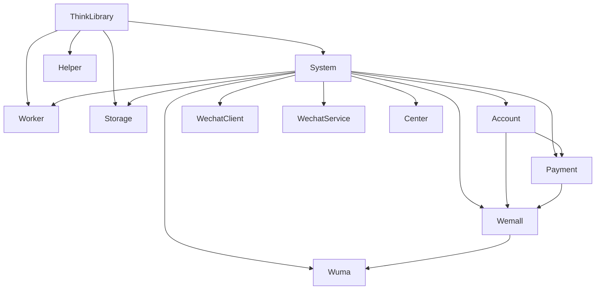

# ThinkAdminDeveloper for ThinkAdmin

**ThinkAdminDeveloper** 是基于 ThinkAdmin 8 / ThinkPHP 8.1 的组件化开发仓库，用于维护核心基础库、运行时组件、后台平台插件和业务插件。

## 版本基线

- ThinkAdmin `8.x`
- ThinkPHP `8.1+`
- PHP `8.1+`

## 详细描述

- 这个仓库不是单一应用，而是围绕 ThinkAdmin 8 / ThinkPHP 8.1 组织的一组标准组件，覆盖核心库、运行时、后台平台和业务插件。
- 目标不是维护旧版多应用项目，而是把系统重构成“插件优先、单应用兜底、服务注册标准化、组件边界清晰”的结构。
- 当前所有核心能力都已经按组件拆分：`ThinkLibrary` 提供核心层，`System` 提供系统后台与 `system_*` 核心能力，`Worker` 提供常驻运行时，`Storage` 提供存储中心，`Helper` 提供开发与交付工具，业务插件只承载各自业务域。
- 因此这个仓库更适合作为组件化开发基线和业务插件宿主，而不是传统的单仓单应用模板。

## 架构说明

- 核心层：`ThinkLibrary` 提供运行时、认证、任务契约、菜单节点、模型查询和基础工具。
- 系统层：`ThinkPlugsSystem` 提供后台壳层、认证权限、系统用户，以及 `system_*` 共享配置、字典、扩展数据和操作日志。
- 运行层：`ThinkPlugsWorker` 用 Workerman 托管 `http` 和 `queue` 两类常驻服务。
- 平台层：`ThinkPlugsCenter`、`ThinkPlugsStorage`、`ThinkPlugsWechatClient`、`ThinkPlugsWechatService` 提供插件平台和标准能力入口。
- 业务层：`ThinkPlugsAccount`、`ThinkPlugsPayment`、`ThinkPlugsWemall`、`ThinkPlugsWuma` 负责各自业务域。
- 交付层：`ThinkPlugsHelper` 和 `ThinkPlugsStatic` 负责发布、迁移、安装包、静态资源和项目骨架。



## 仓库组成

### 核心组件

- **ThinkLibrary**
  核心基础库，负责运行时、JWT、任务协议、控制器和公共工具。
- **ThinkPlugsSystem**
  系统后台组件，负责登录、权限、菜单、用户和 `system_*` 核心能力。
- **ThinkPlugsWorker**
  Workerman 运行时组件，负责 `http` 和 `queue` 常驻服务，并提供基于固定命令签名的跨平台进程控制能力。Linux / macOS 优先走 Workerman 守护化与信号控制，Windows 通过 `console.exe` 启动后台 PHP 进程，`status / query / stop / restart / check` 不再只依赖 `pidFile`。
- **ThinkPlugsHelper**
  开发辅助组件，负责迁移导出、发布、安装包和注释生成。
- **ThinkPlugsStorage**
  存储中心组件，负责驱动注册、上传授权和标准化配置。
- **ThinkPlugsStatic**
  静态资源和项目骨架组件。

### 平台插件
- **ThinkPlugsCenter**
  插件应用中心。
- **ThinkPlugsWechatClient**
  公众号标准平台。
- **ThinkPlugsWechatService**
  公众号开放平台。

### 业务插件

- **ThinkPlugsAccount**
  多端账号体系。
- **ThinkPlugsPayment**
  支付中心。
- **ThinkPlugsWemall**
  分销商城。
- **ThinkPlugsWuma**
  一物一码与防伪溯源。

## 当前架构约定

### 路由与应用

- `app` 只保留一个 `single_app`
- 插件通过 URL 前缀注册访问入口
- 请求首段命中插件前缀时切换到插件
- 未命中插件前缀时回退到单应用
- 动态插件切换默认关闭
- 页面入口统一使用 `/{plugin}/...`
- 接口入口统一使用 `/api/{plugin}/{controller}/{action}`
- 页面链接统一使用 `sysuri()`，接口链接统一使用 `apiuri()`
- 旧 `/{plugin}/api.xxx/...` 只保留兼容，不再作为新代码标准

### 服务注册

- ThinkPHP 服务注册统一使用 `composer.json > extra.think.services`
- 插件运行时元数据统一使用 `composer.json > extra.xadmin.service`
- 菜单元数据统一使用 `composer.json > extra.xadmin.menu`
- 迁移元数据统一使用 `composer.json > extra.xadmin.migrate`

### 认证

- 后台与 API 统一优先使用 `Authorization: Bearer <JWT>`
- 不再使用 Session 或认证 Cookie 承载后台登录态
- 后台壳页首跳允许一次性 `access_key` 引导，后续请求统一落到 `Authorization`
- 用户临时态统一使用基于 Token SID 的 `CacheSession`
- 统一入口为 `tsession()`

统一请求头约定：

- 认证令牌：`Authorization: Bearer <token>`
- 设备接口附加头：`X-Device-Code`、`X-Device-Type`
- 不再使用 `Api-Token`、`Api-Type`、`Api-Code` 这类旧请求头

### 运行时

- 统一命令入口：`php think xadmin:worker`
- `http` 负责托管系统 HTTP 服务
- `queue` 负责长耗时任务和延时任务调度
- `ThinkLibrary` 只定义队列契约与调用门面，队列记录由 `ThinkPlugsWorker` 维护
- 运行时进程统一以 `xadmin:worker serve <service>` 作为命令签名，CLI 与后台状态管理都围绕该签名进行进程识别
- `pidFile` 只保留为 Workerman 辅助运行文件，不再作为唯一状态来源；当 pid 文件缺失、脏数据残留或被误删时，会自动回退到进程扫描与健康检查
- Windows 后台服务统一通过 `plugin/think-plugs-worker/src/service/bin/console.exe` 启动，Linux / macOS 仍保留 Workerman 守护化与 reload 语义

### PHAR 路径约定

当使用 `ThinkPlugsBuilder` 构建并以 `admin.phar` 方式运行时，请遵循下面约定：

- `syspath()`：读取 **PHAR 包内**只读资源（如 `public/static`、内置模板/数据）
- `runpath()`：读写 **PHAR 外部**可写目录（如 `runtime/`、`safefile/`、`database/`、`public/upload/`、Worker 的 pid/log/status/stdout 文件）

更完整的构建与运行说明请参考 `plugin/think-plugs-builder/readme.md`。

### 前端

- 后台统一使用 `LayUI + $.module.use(...)`
- `RequireJS` 已彻底移除
- 数据导出统一使用前端 JavaScript 模块
- 系统脚本统一下发 `taSystem / taSystemApi / taStorage / taStorageApi / taApiPrefix`
- 上传、图标、队列等高频模块优先消费这组变量，不再手工拼 `api.xxx`

### 双入口示例

- 页面：`/system/index/index`
- 页面：`/storage/config/index`
- 接口：`/api/system/plugs/script`
- 接口：`/api/storage/upload/file`
- 接口：`/api/wechat/view/news?id=1`
- 接口：`/api/plugin-wechat-service/client/jsonrpc?token=TOKEN`

### 目录

- `app` 只保留单应用入口
- 实际源码只维护在 `plugin/*/src`

## 开发工具

### PHPStan 静态代码分析

项目已集成 PHPStan 2.0，用于代码质量检查和静态分析。

```bash
# 运行代码分析
composer analyse

# 分析结果无错误时输出：[OK] No errors
```

配置说明：

- 配置文件：`phpstan.neon`
- 检查级别：`level 0`（最宽松，可逐步提升）
- 检查范围：`app/`, `config/`, `plugin/`
- 已配置 ThinkPHP 框架函数兼容性规则
- 排除目录：`runtime/`, `vendor/`, `tests/`

### 代码风格

使用 PHP-CS-Fixer 统一代码风格：

```bash
# 自动修复代码风格
composer sync
```

## 安装与初始化

```bash
# 安装依赖
composer update --optimize-autoloader

# 发布配置、静态资源和迁移脚本（不执行建表）
php think xadmin:publish

# 执行安装迁移，自动创建或更新数据表
php think xadmin:publish --migrate

# 可选：检查迁移执行状态
php think migrate:status

# 启动 HTTP 服务
php think xadmin:worker start http -d
```

说明：

- `composer update` 只会执行服务发现，不会自动创建数据表。
- `php think xadmin:publish` 只负责发布配置、静态资源并同步各插件 `stc/database` 到根目录 `database/migrations`。
- `php think xadmin:publish --migrate` 会在发布完成后自动执行 `migrate:run`，这是安装阶段真正创建或更新数据表的步骤。
- 如果是全新环境，必须至少执行一次 `php think xadmin:publish --migrate`。

默认访问地址：

- `http://127.0.0.1:2346`（可通过 `config/worker.php` 修改端口）

## 常用命令

```bash
# 查看全部命令
php think list

# 启动 HTTP 服务
php think xadmin:worker start http -d

# 启动队列服务
php think xadmin:worker start queue -d

# 查看运行状态
php think xadmin:worker status all

# 代码质量检查
composer analyse

# 代码风格修复
composer sync

# 生成插件迁移脚本
php think xadmin:helper:migrate

# 生成安装包
php think xadmin:package
```

## 发布与迁移

`xadmin:publish` 由 `ThinkPlugsHelper` 提供，负责：

- 发布插件 `stc/config`
- 发布 `ThinkPlugsStatic` 的骨架与静态资源
- 发布 `ThinkPlugsWorker` 的 `config/worker.php`
- 同步各插件 `stc/database` 到根目录 `database/migrations`
- 通过 `database/migrations/.xadmin-published.json` 清理历史失效或冲突迁移

执行规则：

- `php think xadmin:publish` 只同步资源和迁移脚本，不执行数据库安装。
- `php think xadmin:publish --migrate` 会在同步完成后自动调用 `migrate:run`，安装或升级数据库表结构。
- 根目录 `database/migrations` 是发布产物，真正执行的也是这里的迁移脚本。

当前约定为：

- 每个插件只保留一份最终安装脚本
- 根目录 `database/migrations` 视为发布产物

## 平台说明

- Windows 兼容
- Linux 兼容
- `Worker reload` 仅适用于 Linux / macOS

## 开发文档

- 官网文档：[thinkadmin.top](https://thinkadmin.top)
- 接口文档：[ThinkAdminMobile](https://thinkadmin.apifox.cn)
- 架构总图：[plugin-boundaries.md](/Users/anyon/Runtime/ThinkAdminDeveloper/docs/architecture/plugin-boundaries.md)
- 架构说明：[plugin-first-refactor.md](/Users/anyon/Runtime/ThinkAdminDeveloper/docs/architecture/plugin-first-refactor.md)
- 认证与会话：[auth-token-session.md](/Users/anyon/Runtime/ThinkAdminDeveloper/docs/architecture/auth-token-session.md)
- 稳定性评估：[stability-status.md](/Users/anyon/Runtime/ThinkAdminDeveloper/docs/architecture/stability-status.md)

## 注意事项

- 本仓库包含会员插件，未授权不得商用
- 插件卸载通常不会自动删除已执行迁移和历史数据
- 自定义前端脚本建议放在 `public/static/extra`

## 许可证

除会员授权插件外，其余开源部分按各组件自身许可证发布。
