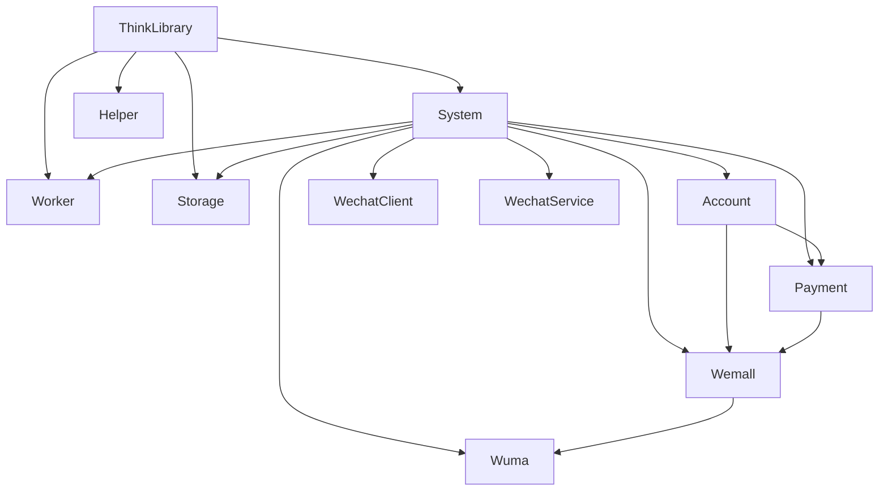

# ThinkAdminDeveloper for ThinkAdmin

**ThinkAdminDeveloper** 是基于 ThinkAdmin 8 / ThinkPHP 8.1 的组件化开发仓库，用于维护核心基础库、运行时组件、后台平台插件和业务插件。

## 版本基线

- ThinkAdmin `8.x`
- ThinkPHP `8.1+`
- PHP `8.1+`

## 详细描述

- 这个仓库不是单一应用，而是围绕 ThinkAdmin 8 / ThinkPHP 8.1 组织的一组标准组件，覆盖核心库、运行时、后台平台、业务插件和本地多应用。
- 目标不是维护旧版多应用项目，而是把系统重构成"插件优先、本地应用兼容、服务注册标准化、组件边界清晰"的结构。
- 当前所有核心能力都已经按组件拆分：`ThinkLibrary` 提供核心层，`System` 提供系统后台与 `system_*` 核心能力，`Worker` 提供常驻运行时，`Storage` 提供存储中心，`Helper` 提供开发与交付工具，业务插件只承载各自业务域。
- 因此这个仓库更适合作为组件化开发基线和业务插件宿主，同时支持本地多应用扩展，而不是传统的单仓单应用模板。

## 架构说明

- **本地应用层**：`app/*` 提供本地多应用能力，`app/index` 为默认本地应用，支持按需扩展其他本地应用
- **核心层**：`ThinkLibrary` 提供运行时、认证、任务契约、菜单节点、模型查询和基础工具。
- **运行层**：`ThinkPlugsWorker` 用 Workerman 托管 `http` 和 `queue` 两类常驻服务。
- **系统层**：`ThinkPlugsSystem` 提供后台壳层、认证权限、系统用户，以及 `system_*` 共享配置、字典、扩展数据、操作日志和存储中心能力。
- **业务层**：`ThinkPlugsAccount`、`ThinkPlugsPayment`、`ThinkPlugsWemall`、`ThinkPlugsWuma` 负责各自业务域。
- **交付层**：`ThinkPlugsHelper` 和 `ThinkPlugsStatic` 负责发布、迁移、安装包、静态资源和项目骨架。



## 仓库组成

详细组件说明请参考：[组件详细文档](./docs/components-detail.md)

### 核心组件

- **ThinkLibrary** (`zoujingli/think-library`)
  核心基础库，提供运行时、JWT 令牌、任务协议、标准控制器、模型扩展和公共工具。
    - 命名空间：`think\admin\`
    - 服务注册：`think\admin\Library`
    - 主要功能：插件发现、路由适配、认证会话、队列契约、Storage 门面
    - 核心工具：QueryHelper、FormBuilder、PageBuilder、JwtToken、CacheSession
    - 扩展能力：图片滑块验证码、JSON-RPC 客户端/服务端、网站图标生成
    - 全局函数：syspath()、runpath()、sysuri()、apiuri()、tsession() 等
    - 许可证：MIT

- **ThinkPlugsSystem** (`zoujingli/think-plugs-system`)
  系统后台组件，提供后台壳层、认证权限、菜单用户和 `system_*` 核心能力。
    - 命名空间：`plugin\system\`
    - 服务注册：`plugin\system\Service`
    - 数据表：`system_auth`, `system_auth_node`, `system_menu`, `system_user`, `system_data`, `system_base`, `system_oplog`
    - 默认菜单：系统配置、系统数据、权限管理
    - 核心功能：JWT 认证、RBAC 权限、系统配置、操作日志、任务管理
    - 中间件：JwtTokenAuth、RbacAccess
    - 许可证：MIT

- **ThinkPlugsWorker** (`zoujingli/think-plugs-worker`)
  Workerman 运行时组件，负责 `http` 和 `queue` 常驻服务，提供跨平台进程管理能力。
    - 命名空间：`plugin\worker\`
    - 服务注册：`plugin\worker\Service`
    - 数据表：`system_queue`
    - 命令入口：`php think xadmin:worker`
    - 跨平台：Linux/macOS 使用 Workerman 守护进程，Windows 使用 console.exe
    - 核心服务：HTTP 服务（默认 4 进程）、队列服务（任务调度）
    - 进程管理：状态监控、内存监控、文件监控、健康检查
    - 许可证：Apache-2.0

- **ThinkPlugsHelper** (`zoujingli/think-plugs-helper`)
  开发辅助组件，提供迁移工具、发布命令、安装包生成和开发辅助功能。
    - 命名空间：`plugin\helper\`
    - 服务注册：`plugin\helper\Service`
    - 主要命令：`xadmin:publish`, `xadmin:package`, `xadmin:helper:*`
    - 核心功能：插件迁移、安装包构建、菜单元数据校验、模型注释生成
    - 元数据管理：插件服务、插件元数据、菜单元数据、迁移元数据
    - 许可证：Apache-2.0

- **ThinkPlugsStatic** (`zoujingli/think-plugs-static`)
  静态资源和项目骨架组件，提供前端静态文件、模板和项目初始化骨架。
    - 无前缀，通过其他插件间接使用
    - 主要功能：静态资源发布、项目骨架生成
    - 发布内容：配置文件、入口文件、LayUI 前端资源、系统脚本
    - 前端约定：只保留 LayUI 模块加载，移除 RequireJS
    - 许可证：MIT

### 平台插件

- **ThinkPlugsWechatClient** (`zoujingli/think-plugs-wechat-client`)
  微信公众号标准平台，提供公众号基础能力、菜单管理、消息推送等。
    - 命名空间：`plugin\wechat\`
    - 服务注册：`plugin\wechat\Service`
    - 访问前缀：`wechat`
    - 数据表：微信配置、粉丝、素材、菜单、关键词回复、支付记录等
    - 核心功能：公众号配置、粉丝同步、素材管理、菜单管理、关键词回复、微信支付
    - 命令：`xadmin:fansall`, `xadmin:fansmsg`, `xadmin:fanspay`
    - 许可证：MIT

- **ThinkPlugsWechatService** (`zoujingli/think-plugs-wechat-service`)
  微信公众号开放平台，提供第三方平台托管、授权管理和远程 JSON-RPC 服务。
    - 命名空间：`plugin\wechat\service\`
    - 服务注册：`plugin\wechat\service\Service`
    - 访问前缀：`plugin-wechat-service`
    - 数据表：第三方授权、组件配置
    - 核心功能：开放平台配置、授权管理、JSON-RPC 远程调用、推送事件接收
    - 命令：`xsync:wechat`
    - 许可证：专有授权

### 业务插件

- **ThinkPlugsAccount** (`zoujingli/think-plugs-account`)
  多端账号体系，统一管理用户账号、终端设备和短信服务。
    - 命名空间：`plugin\account\`
    - 服务注册：`plugin\account\Service`
    - 访问前缀：`account`
    - 数据表：用户账号、终端绑定、短信记录等
    - 核心功能：多端账号管理、微信登录、短信验证、账号绑定、JWT 认证
    - 接口入口：`/api/account/login/*`, `/api/account/auth/*`
    - 依赖：ThinkLibrary, ThinkPlugsHelper, ThinkPlugsSystem
    - 许可证：专有授权（VIP）

- **ThinkPlugsPayment** (`zoujingli/think-plugs-payment`)
  支付中心，统一管理支付配置、交易记录、退款、余额和积分。
    - 命名空间：`plugin\payment\`
    - 服务注册：`plugin\payment\Service`
    - 访问前缀：`payment`
    - 数据表：支付配置、交易记录、退款记录、余额明细、积分明细
    - 核心功能：支付配置、混合支付、余额积分、退款管理、支付事件分发
    - 支付事件：Audit/Refuse/Success/Cancel/Confirm
    - 依赖：ThinkLibrary, ThinkPlugsHelper, ThinkPlugsAccount, ThinkPlugsSystem
    - 许可证：专有授权（VIP）

- **ThinkPlugsWemall** (`zoujingli/think-plugs-wemall`)
  分销商城系统，提供完整的电商管理能力。
    - 命名空间：`plugin\wemall\`
    - 服务注册：`plugin\wemall\Service`
    - 访问前缀：`wemall`
    - 数据表：商品、订单、用户、等级、代理、物流等
    - 核心功能：商品管理、订单管理、分销返利、会员等级、商城 API
    - 命令：`xdata:mall:clear`, `xdata:mall:trans`, `xdata:mall:users`
    - 依赖：ThinkLibrary, ThinkPlugsHelper, ThinkPlugsAccount, ThinkPlugsPayment, ThinkPlugsSystem
    - 许可证：专有授权（VIP）

- **ThinkPlugsWuma** (`zoujingli/think-plugs-wuma`)
  一物一码与防伪溯源系统。
    - 命名空间：`plugin\wuma\`
    - 服务注册：`plugin\wuma\Service`
    - 访问前缀：`wuma`
    - 数据表：防伪码、溯源记录、仓储管理、代理库存等
    - 核心功能：一物一码、溯源管理、仓储流转、代理库存、扫码验证
    - 命令：`xdata:wuma:create`
    - 接口请求头：`Authorization`, `X-Device-Code`, `X-Device-Type`
    - 依赖：ThinkLibrary, ThinkPlugsHelper, ThinkPlugsWemall, ThinkPlugsSystem
    - 许可证：专有授权（VIP）

## 当前架构约定

### 路由与应用

- `app/*` 支持本地多应用，`app/index` 为默认本地应用
- 本地应用入口：`/{app}/{controller}/{action}`（默认应用可省略首段）
- 插件通过 URL 前缀注册访问入口
- 请求首段命中插件前缀时切换到插件
- 未命中插件前缀时回退到本地应用
- 动态插件切换默认关闭
- 页面入口统一使用 `/{plugin}/...`
- 接口入口统一使用 `/api/{plugin}/{controller}/{action}`
- 页面链接统一使用 `sysuri()`，接口链接统一使用 `apiuri()`
- 旧 `/{plugin}/api.xxx/...` 只保留兼容，不再作为新代码标准

### 服务注册

- ThinkPHP 服务注册统一使用 `composer.json > extra.think.services`
- 插件运行时元数据统一使用 `composer.json > extra.xadmin.service`
- 菜单元数据统一使用 `composer.json > extra.xadmin.menu`
- 迁移元数据统一使用 `composer.json > extra.xadmin.migrate`

### 认证

- 后台与 API 统一优先使用 `Authorization: Bearer <JWT>`
- 不再使用 Session 或认证 Cookie 承载后台登录态
- 后台壳页首跳允许一次性 `access_key` 引导，后续请求统一落到 `Authorization`
- 用户临时态统一使用基于 Token SID 的 `CacheSession`
- 统一入口为 `tsession()`

统一请求头约定：

- 认证令牌：`Authorization: Bearer <token>`
- 设备接口附加头：`X-Device-Code`、`X-Device-Type`
- 不再使用 `Api-Token`、`Api-Type`、`Api-Code` 这类旧请求头

### 运行时

- 统一命令入口：`php think xadmin:worker`
- `http` 负责托管系统 HTTP 服务
- `queue` 负责长耗时任务和延时任务调度
- `ThinkLibrary` 只定义队列契约与调用门面，队列记录由 `ThinkPlugsWorker` 维护
- 运行时进程统一以 `xadmin:worker serve <service>` 作为命令签名，CLI 与后台状态管理都围绕该签名进行进程识别
- `pidFile` 只保留为 Workerman 辅助运行文件，不再作为唯一状态来源；当 pid 文件缺失、脏数据残留或被误删时，会自动回退到进程扫描与健康检查
- Windows 后台服务统一通过 `plugin/think-plugs-worker/src/service/bin/console.exe` 启动，Linux / macOS 仍保留 Workerman 守护化与 reload 语义

### PHAR 路径约定

当使用 `ThinkPlugsBuilder` 构建并以 `admin.phar` 方式运行时，请遵循下面约定：

- `syspath()`：读取 **PHAR 包内**只读资源（如 `public/static`、内置模板/数据）
- `runpath()`：读写 **PHAR 外部**可写目录（如 `runtime/`、`safefile/`、`database/`、`public/upload/`、Worker 的 pid/log/status/stdout 文件）

更完整的构建与运行说明请参考 `plugin/think-plugs-builder/readme.md`。

### 前端

- 后台统一使用 `LayUI + $.module.use(...)`
- `RequireJS` 已彻底移除
- 数据导出统一使用前端 JavaScript 模块
- 系统脚本统一下发 `taSystem / taSystemApi / taStorage / taStorageApi / taApiPrefix`
- 上传、图标、队列等高频模块优先消费这组变量，不再手工拼 `api.xxx`

### 双入口示例

- 页面：`/system/index/index`
- 页面：`/storage/config/index`
- 接口：`/api/system/plugs/script`
- 接口：`/api/storage/upload/file`
- 接口：`/api/wechat/view/news?id=1`
- 接口：`/api/plugin-wechat-service/client/jsonrpc?token=TOKEN`

### 目录

- `app/*` 支持本地多应用扩展，实际源码可维护在 `app/*/controller` 或 `plugin/*/src`
- 核心业务源码优先维护在 `plugin/*/src`

## 开发工具

### PHPStan 静态代码分析

项目已集成 PHPStan 2.0，用于代码质量检查和静态分析。

```bash
# 运行代码分析
composer analyse

# 分析结果无错误时输出：[OK] No errors
```

配置说明：

- 配置文件：`phpstan.neon`
- 检查级别：`level 3`（已开启更多真实异常检查）
- 检查范围：`app/`, `config/`, `plugin/`
- 通过 `scanFiles` 显式加载 ThinkPHP 与项目公共函数
- 排除目录：`runtime/`, `vendor/`

### 代码风格

使用 PHP-CS-Fixer 统一代码风格：

```bash
# 自动修复代码风格
composer sync
```

### 测试

运行所有测试：

```bash
# 运行所有测试
composer test

# 仅运行冒烟测试
composer test:smoke

# 仅运行单元测试
composer test:unit
```

测试覆盖包括：

- 架构边界测试（插件依赖、迁移归属、Composer 边界）
- 核心功能测试（JWT、CacheSession、Helper 工具）
- 控制器集成测试（System、Account、Payment、Worker）
- 业务集成测试（支付事件、账号绑定）

## 安装与初始化

```bash
# 安装依赖
composer update --optimize-autoloader

# 发布配置、静态资源和迁移脚本（不执行建表）
php think xadmin:publish

# 执行安装迁移，自动创建或更新数据表
php think xadmin:publish --migrate

# 可选：检查迁移执行状态
php think migrate:status

# 启动 HTTP 服务
php think xadmin:worker start http -d
```

说明：

- `composer update` 只会执行服务发现，不会自动创建数据表。
- `php think xadmin:publish` 只负责发布配置、静态资源并同步各插件 `stc/database` 到根目录 `database/migrations`。
- `php think xadmin:publish --migrate` 会在发布完成后自动执行 `migrate:run`，这是安装阶段真正创建或更新数据表的步骤。
- 如果是全新环境，必须至少执行一次 `php think xadmin:publish --migrate`。

默认访问地址：

- `http://127.0.0.1:2346`（可通过 `config/worker.php` 修改端口）

## 常用命令

```bash
# 查看全部命令
php think list

# 启动 HTTP 服务
php think xadmin:worker start http -d

# 启动队列服务
php think xadmin:worker start queue -d

# 查看运行状态
php think xadmin:worker status all

# 代码质量检查
composer analyse

# 代码风格修复
composer sync

# 生成插件迁移脚本
php think xadmin:helper:migrate

# 生成安装包
php think xadmin:package
```

## 发布与迁移

`xadmin:publish` 由 `ThinkPlugsHelper` 提供，负责：

- 发布插件 `stc/config`
- 发布 `ThinkPlugsStatic` 的骨架与静态资源
- 发布 `ThinkPlugsWorker` 的 `config/worker.php`
- 同步各插件 `stc/database` 到根目录 `database/migrations`
- 通过 `database/migrations/.xadmin-published.json` 清理历史失效或冲突迁移

执行规则：

- `php think xadmin:publish` 只同步资源和迁移脚本，不执行数据库安装。
- `php think xadmin:publish --migrate` 会在同步完成后自动调用 `migrate:run`，安装或升级数据库表结构。
- 根目录 `database/migrations` 是发布产物，真正执行的也是这里的迁移脚本。

当前约定为：

- 每个插件只保留一份最终安装脚本
- 根目录 `database/migrations` 视为发布产物，不纳入源码维护

## 平台说明

- Windows 兼容
- Linux 兼容
- `Worker reload` 仅适用于 Linux / macOS

## 开发文档

- 官网文档：[thinkadmin.top](https://thinkadmin.top)
- 接口文档：[ThinkAdminMobile](https://thinkadmin.apifox.cn)
- 架构文档：
    - [插件边界](./docs/architecture/plugin-boundaries.md)
    - [插件优先重构](./docs/architecture/plugin-first-refactor.md)
    - [认证与会话](./docs/architecture/auth-token-session.md)
    - [稳定性评估](./docs/architecture/stability-status.md)
    - [插件标准](./docs/architecture/plugin-standard.md)
    - [路由分发标准](./docs/architecture/route-dispatch-standard.md)
    - [软删除标准](./docs/architecture/soft-delete-standard.md)
- 组件详细文档：[components-detail.md](./docs/components-detail.md)

## 注意事项

- 本仓库包含会员插件，未授权不得商用
- 插件卸载通常不会自动删除已执行迁移和历史数据
- 自定义前端脚本建议放在 `public/static/extra`

## 许可证

除会员授权插件外，其余组件按各自许可证发布：

- **MIT**: ThinkLibrary, System, WechatClient, Static
- **Apache-2.0**: Worker, Helper, Builder
- **专有授权**: Account, Payment, Wemall, Wuma, WechatService

未获得授权的插件（Account/Payment/Wemall/Wuma/WechatService）不得用于商业用途。
